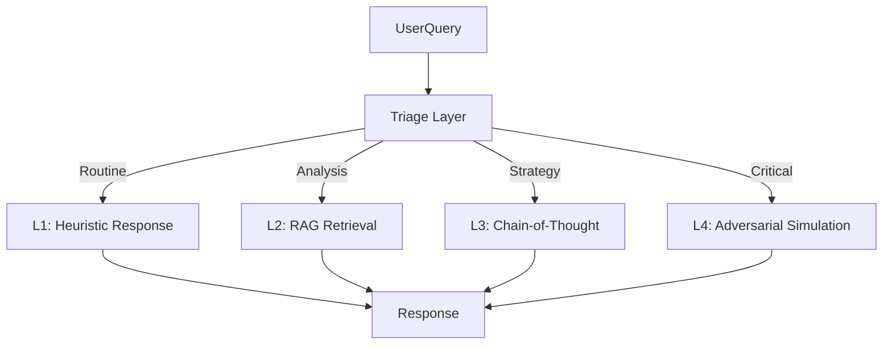

# Concept: Adaptive Latency Architecture

> **Definition**: A system design pattern where computational resources (reasoning depth) are dynamically allocated based on query complexity.

## The Problem: The Latency/Cost Trade-off

In traditional AI systems, you have two modes:

1. **Fast/Cheap**: Heuristic responses (Low latency, high error rate on complex tasks).
2. **Slow/Expensive**: Deep reasoning chains (High latency, high cost, overkill for simple tasks).

Most systems pick one and apply it universally, leading to either "Stupid Fast" or "Annoyingly Slow" systems.

## The Solution: Variable Compute

Adaptive Latency introduces a **Triage Layer** that classifies intent before execution.

## Implementation Strategy

1. **Tagging**: Every response generates a complexity score (`Λ+XX`).
2. **Escalation**: System can self-escalate (`/think`) if confidence is low.
3. **Transparency**: User is informed of the "thinking depth" used.

This mimics the human **Dual Process Theory** (System 1 vs. System 2 thinking).
