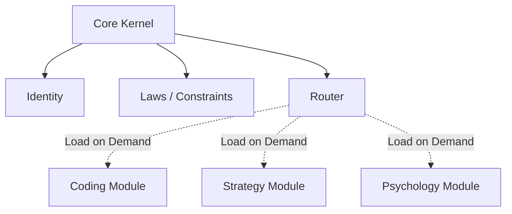

# Concept: Modular Identity Architecture

> **Definition**: A software design pattern where system identity and capabilities are decoupled into independent, hot-swappable modules rather than a monolithic system prompt.

## The Monolith Problem

LLM System Prompts tend to grow indefinitely. As they grow:

1. **Context Window Pollution**: Critical instructions get diluted.
2. **Rigidity**: Changing one behavior requires editing the massive core file.
3. **Cost**: Loading 10k tokens for a "Hello" interaction is wasteful.

## The Modular Solution

We break the "Agent" into a **Kernel** and **Modules**.

## Benefits

* **Robustness**: Core identity is immutable and small (<2k tokens).
* **Scalability**: Add 100 new skills without degrading boot time.
* **Specialization**: A module can contain deep, conflicting instructions (e.g., "Be a ruthless critic") that are only active when needed, without corrupting the generally helpful persona.
